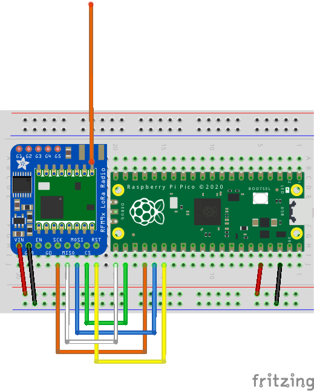

# Dongle

The dongle consists of:

1. A Raspberry Pi Pico
2. An Adafruit RFM96W LoRa Radio Transceiver (Adafruit part 3073)
3. An aerial tuned to 433 Mhz, such as a 'Simple Spring Antenna' or even a length of plain wire (approx 17cm in length)
4. Connecting wire
5. (Optional) Breadboard

The components are available in the UK from stores like 'the Pi Hut' and 'Pimoroni':

| Part | Pimoroni | the Pi Hut |
|-|-|-|
|Pico|[SCO917](https://shop.pimoroni.com/products/raspberry-pi-pico?variant=40059364311123)|[SC0917](https://thepihut.com/products/raspberry-pi-pico?variant=41925332566211)|
|LoRa Transceiver|[ADA3073](https://shop.pimoroni.com/products/adafruit-rfm95w-lora-radio-transceiver-breakout?variant=19595468359)|[ADA3073](https://thepihut.com/products/adafruit-rfm96w-lora-radio-transceiver-breakout-433-mhz?variant=27740305809)|
|Spring Antenna||[ADA4394](https://thepihut.com/products/simple-spring-antenna-433mhz?variant=31201813594174)|
|Connecting wire||[102394](https://thepihut.com/products/thepihuts-jumper-bumper-pack-120pcs-dupont-wire)|
|Breadboard||[102817](https://thepihut.com/products/full-sized-breadboard)|

`Caution: Ensure you purchase the 433Mhz variants of the transceiver and antenna.  Variants for 868Mhz/915Mhz/etc will not work`

## Assembly

Some familiarity with soldering is required to attach the headers and aerial to the transceiver board.

Connect the Pico and Transceiver board per the diagram:

## Firmware

The firmware is coded in [TinyGo](https://tinygo.org) See the `dongle` folder.

To flash the dongle:

1. Install TinyGo (see [Quick Install Guide](https://tinygo.org/getting-started/install/))
2. Press the `BOOTSEL` on the Pico whilst plugging in the USB cable
3. Check a drive `RPI-RP2` appears on your computer
4. In the `dongle` folder, run `tinygo flash -target pico .`
5. The command should succeed and the `RPI-RP2` drive disappear