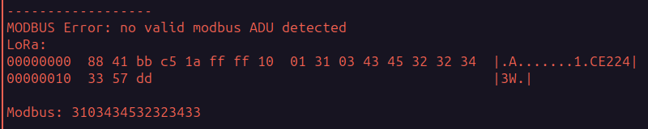
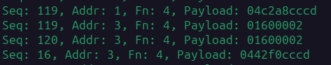

# Observations

Looking at the radio traffic, it's possible to make a number of observations:

## Frequent Errors

It appears the GivEnergy inverter is frequently pushing corrupt packets into the modbus.  An example:

This is a fully valid LoRa packet from the LoRa module (the protocol fields and checksum are valid) - however the payload is not valid modbus and appears to be the partial serial number of the GivEnergy inverter.

Most likely this is the result of a memory management bug in the inverter firmware.

## Not modbus compliant

Despite being intended for use in a GivEnergy modbus environment, the LoRa dongle is not compliant with modbus framing.  In the modbus specification, a delay of 3.5 characters is required between each modbus frame.  However, the dongle is observed to combine multiple modbus frames into a single LoRa frame without suitable metadata to re-separate the frames at the other end.  This leads to frequent re-transmission events.

In the example log, multiple modbus packets have been combined into a single LoRa packet (seq 119).  The last two modbus packets are:
* A response from Meter ID 1 (04 c2 a8 cc cd)
* A request to Meter ID 3 (01 60 00 02) [read two words starting at 0x0160]

The meter with modbus address 3 cannot detect the frame separation and so does not respond.  The inverter retransmits the request to meter 3, which can now be detected and a response is sent.

## Lack of Security / Encryption

There is no protection against sniffing or against injection of unauthorized modbus packets.  All transmission is in plain text with no regard to confidentiality or integrity of the data.

It is noteworthy that the energy meters can be reconfigured via modbus.