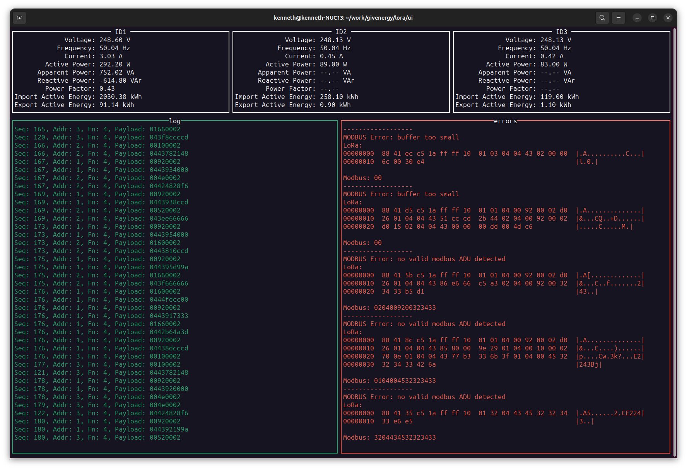

# giv-lora - protocol sniffing for GivEnergy LoRa modules

GivEnergy support their domestic battery systems reading solar generation over a LoRa link.  They recently changed the module used from 'GIV-LORA' which is a Heyuan IOT-L2S-B1 module, to 'GIV-LORA-LCD' with GivEnergy branding.

This repo consists of a description of the new 'GIV-LORA-LCD' [hardware](./HARDWARE.md) internally and the software required to sniff the broadcast LoRa communications.

## Getting Started
Familiarity with the Go programming language is assumed, since there is currently no configuration capabilities - the source code will likely need to be modified to your circumstances.

To get started, you'll need some readily-available hardware components for approx 35GBP.  See [Dongle Instructions](./DONGLE.md) for details on creating and flashing the firmware of a dongle.

* Plug in the prepared dongle
* Get the source: `git clone https://github.com/kenbell/giv-lora`
* Locate which UART/COM port the dongle is plugged into
* Find which channel the LoRa modules are using (press 'Func' button)
* Run the app from the `app` folder using `go run . -port <COM port> -ch <channel>`

If all is well a screen like this should appear and start populating:

## LoRa

The end-user accessible LoRa configuration is limited to selecting 1 of 51 possible channels (frequencies).  The Spreading Factor and Bandwidth appear to be fixed.

* Header: Explicit
* Spreading Factor: 7
* Bandwidth: 125kHz
* Frequency: (51 channels, default 15)
   - Ch  0: 430.1 MHz
   - Ch  1: 430.3 MHz
   - Ch  2: 430.5 MHz
   - Ch  3: 430.7 MHz
   - Ch  4: 430.9 MHz
   - Ch  5: 431.1 MHz
   - ...
   - Ch 26: 435.3 MHz
   - ...
   - Ch 50: 440.1 MHz

    Formula: 430.1 MHz + ch * 200 kHz

## Protocol

The LoRa payload appears to be a proprietary protocol.  An example packet is: `88 41 3b c5 1a ff ff 10 01 66 b8 bb`

The fields are apparently:

  * Signature (2 bytes): `88 41`
  * Packet Seq No (1 byte): `3b`
  * Net ID(?) (2 bytes): `c5 1a`
  * Destination (2 bytes): `ff ff` (broadcast)
  * Source (2 bytes) `10 01`
  * Payload (variable): `66` 'f'
  * Checksum (2 bytes): `b8 bb`

The checksum is CRC Modbus 16 over the entire packet (excluding the checksum itself).

In this example, the payload was the single character 'f' - in practice it is one or more [modbus ADUs](https://en.wikipedia.org/wiki/Modbus#PDU_and_ADU).